Reusability in the Unity world
==============================

----

# Reuse vs reusability

When you build more than one software project with the same technology, you should have a natural interest in reusing building blocks accross those projects to speed up your development.

There are different ways to achieve this objective and several pitfalls along the way. At first you might just kick start a new project by reusing a given set of files from the previous one. On the long run, you might be architecting your projets based on reusable modules. The later solution requires a bit more though and some tooling can help you along the way. This tooling is today missing in the Unity world.

This document describes how reusability can be tackled in the Unity world and introduces a new tool, Uplift, to help you do the work.

# Reuse in the Unity world

If you already know all about unity packages, how to reuse them, the Unity Asset Store, feel free to skip this section.

## Unity Assets

In the video game industry, projects contain not only code but also a heavy amount of media (images, sound, videos, animations, ...). All those elements are grouped under the term **assets**.

These assets get shared between developers, both internally and externally, using different techniques, from sharing a simple folder or zip files to using the Unity Asset Store or online code repositories (github / bitbucket being 2 popular ones), or even websites. The 2 main mechanisms seem today the Unity Asset Store and online source code repositories.

Assets can be shared as sources, or pre-compiled (DLL/Libraries for the code, bundles for the media assets). When sharing pre-compiled assets, those need to be provided for all the platforms one want to support.

For various reasons, Unity as community has had a preference of sharing assets sources, or mixture of asset sources and pre-compiled libraries. The fact that providing binaries for multiple platform is much harder than writing and sharing code with the free version of Unity is probably an important reason. The fact that people who reuse assets want to keep the liberty of modifying the reused assets is another one.

When you import some assets into your Unity project, those assets become an integral part of your project assets. It's up to you to decide how you want to manage them, where you want to have them, if you want to modify them inside your project or not, etc. This flexibility is important to project owners. It is also very unique in the software world, especially in light of reuse.

On a technical note, to track and bind assets into its editor/game models (components, prefabs, scenes) Unity has the concept of asset GUIDs (Globally Unique IDentifier).

## Unity Packages

The Unity package is probably the prefered way of sharing assets accross different teams today, especially as it is the underlying package container for assets distributed through the Unity Asset Store. So it's useful to see how it works, and how it can be used.

I won't go into the details of Unity packages here. Let's say that they are simple archives containing assets and their metadata. The archive is structured after the GUID of the assets it contains.

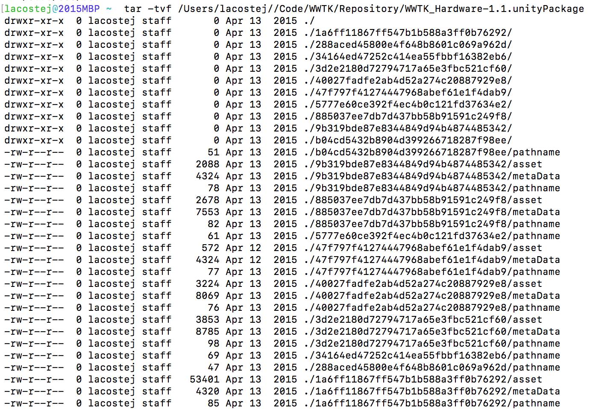

Assets provided by third parties often contain things like documentation, example code, test suite and other goodies.

## Manually importing Unity packages

One typical way to import a package, is by double clicking on a unity package (or drag and dropping it into your project). The Unity editor will popup a dialog to allow you to import the assets into your project.

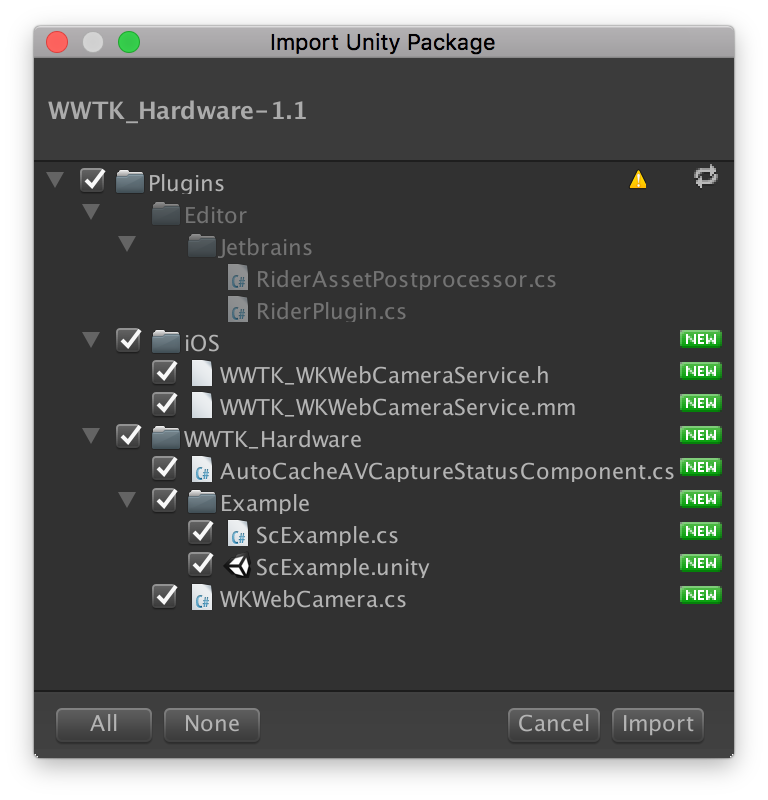

At this point you can decide to import part of the package, but you don't have much say in where these assets are imported. You can nevertheless move those assets later on into a place of better location.

Drawbacks with the current import approach:

* operation is manual and requires a going through a dialog
* there are risk of file conflicts or repository structure pollution if the asset you are importing conflicts with either files or the project layout you had in mind
* there's no advanced package management / repository system like you would see in ruby (gems), node (npm), apart from the Unity Editor + Unity Asset Store:
** no real package dependency management. If you want to create a package B that depends on package A, you will have to tell the user to import A and B, or bundle A inside B. The later solution is not viable in the long term as all your packages would end up including your base package.
** updates are managed manually. Files removed in newer versions of a package are not removed from your project by the package importer.
* given Unity's [script compilation order](https://docs.unity3d.com/Manual/ScriptCompileOrderFolders.html) mechanism, if you want to import your assets into a different compilation unit, you might trigger a recompile after import, which, if your project is large, might cause some issues.
* GUID tracking makes sure that Unity will update your file where it is now in your project, which is practical if you moved the previous version of the assets in your project structure.

More importantly, **nothing prevents you from shooting yourself in the foot**. Imported packages are as much yours as code from your project. You can mess around with them as you see fit. This can lead to versioning trouble or other architecture issues.

# Architecting your Unity software projects

## Skeletons in your closet

Unity doesn't provide a full fledge package manager. It also heavily relies on the AssetStore for distributing assets. And the import process is manual, at the developer discretion. This tends to lead projects to reuse code in a unstructured manner by default.

Typically a company will start with one project, organizing code in modules. After a while your project tends to look like this:

* some project specific modules, depending on some
* generic modules, some maybe obtained from the store

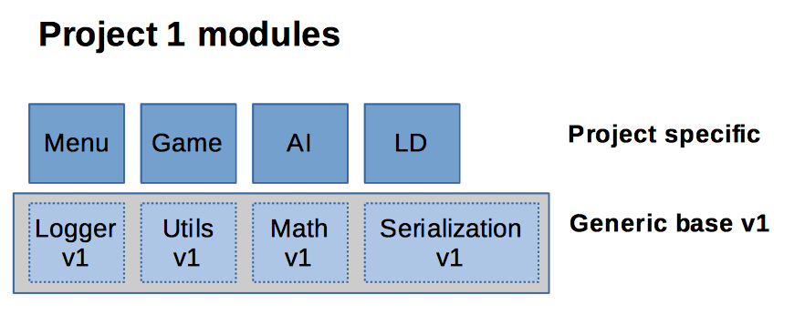

Then you release your project, which goes into maintenance mode. And start a new product.

To kick start your second project, you will copy ('reuse') the modules into your new project. And then as time goes your project look like this:

* some project specific modules, depending on some
* generic modules, some maybe obtained from the store

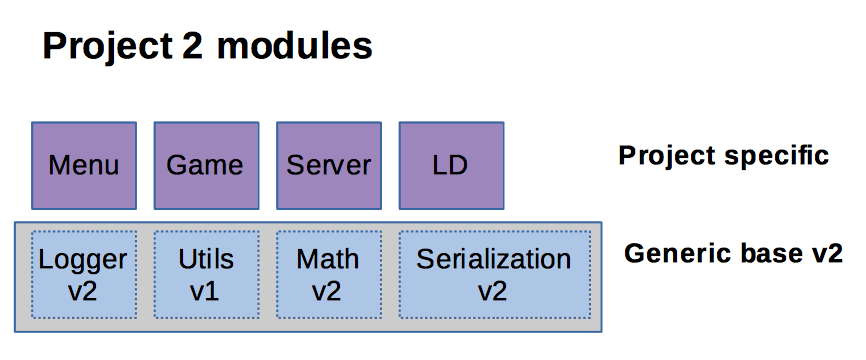

What you created here is a *skeleton*: a base on which to quickly start a project. You have achieved some code reuse.

Your modules in project #2 have sometimes evolved from those in version 1. If you don't need to maintain project #1 on the long run, and if you don't need to retrofit those changes inside project #1, then the drift isn't important.

But skeletons have drawbacks:

* they may hide hard dependencies between modules within the skeleton
* they make it hard to reuse individual modules
* they make it hard to maintain and make them evolve independently

## A better approach to reusability

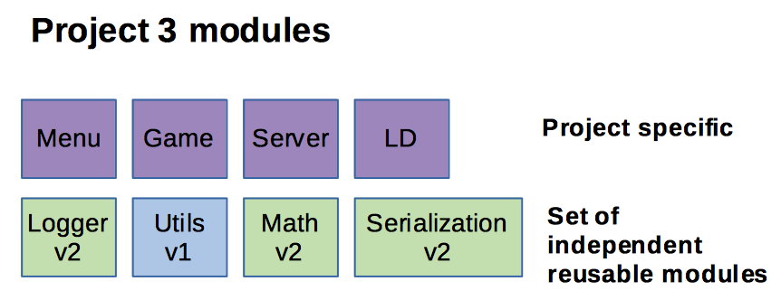

Maintain your independent modules independently and you are free to update them within all your projects.

When you got that way, you need to start thinking a bit differently and take into consideration things like:

* API stability (both in terms of code and Assets - e.g. naming, moving, GUIDs etc)
* versionning of your modules
* dependencies between modules
* way to distribute those modules (packages, folders)
* where to put those modules into your project (project layout)
* places where to store those modules (repositories)
* tooling to manage all that

# Uplift as package manager

Enter uplift. Uplift helps you to manage those very modules you are now thinking about creating.

Uplift if a package manager for Unity. It is extensible and open source. It provides as base functionality tooling to manage packages, their versions, their dependencies, the repositories on which you want to import them from.

Uplift moves the manual import mechanism into a declarative process. Based on the declarations, uplift can repeat the import of the modules. Here's a basic flow:

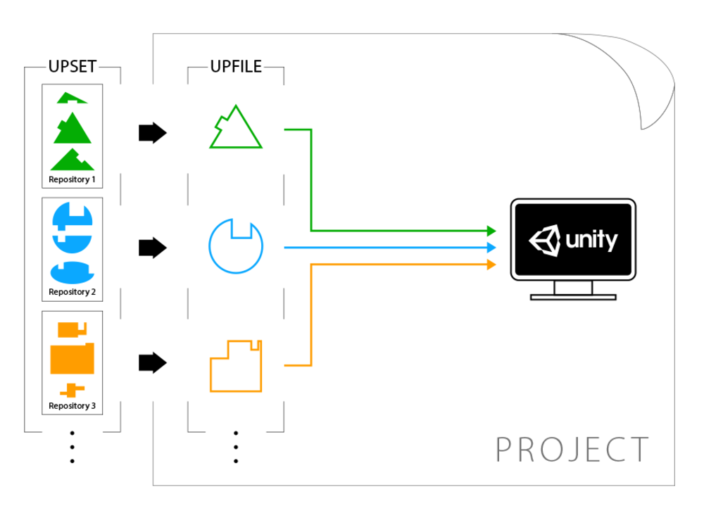

Note: uplift depends on the concept of repositories, i.e. the places to store your prepackaged modules. Right now, uplift supports file system repositories only. This will change soon. Given the OS integration of services like Dropbox / Google Drive, it shouldn't be hard for you to create a shared repository mapped to a local computer folder.

Uplift also brings the following concepts:

* an **Upfile** inside your project, which tells uplift which repositories to search for dependencies, which dependencies your project depend on, and how to incorporate them into your project

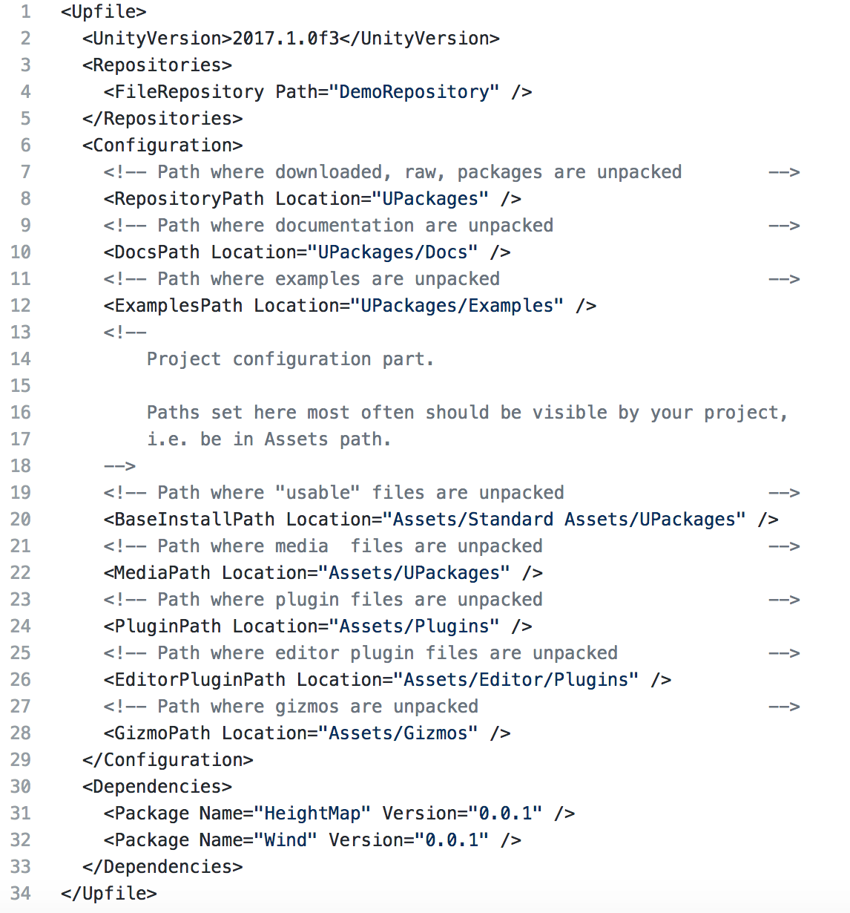

* for each dependent module, an **Upset** file, which provides metadata about your module, including its dependencies, and type of the contained assets (e.g. documentation, examples, plugins, etc).

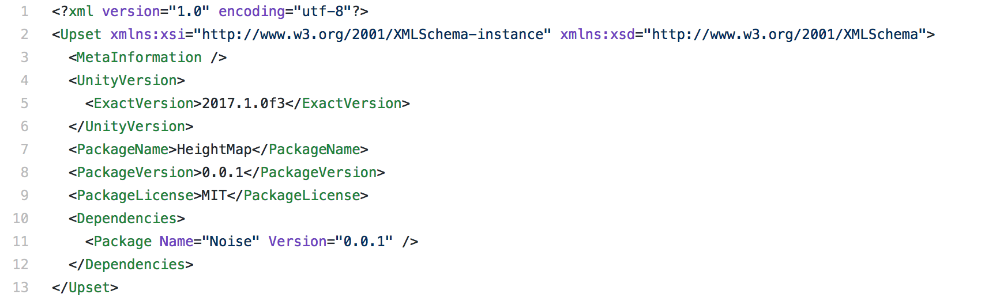

* the **Upbring** file, which is basically state information about the imported modules. This file is maintained by uplift itself and you will not have to edit it.

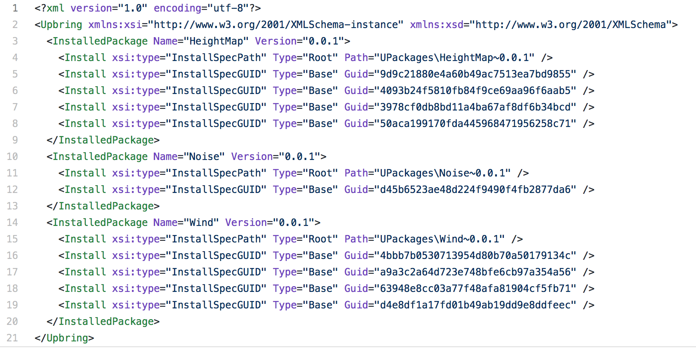

Uplift comes with some tooling to help you create the upset and upfile files.

## Scenario: setting up uplift

When you set up uplift, you can create a default `Upfile.xml` file.

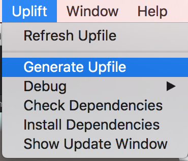

You will be ready to start adding and importing dependencies soon enough.

Here's a shortened version of it:

```xml
<?xml version="1.0"?>
<Upfile>
  <UnityVersion>5.6.0f3</UnityVersion>
  <Repositories>
    <FileRepository Path="../Repository"/>
  </Repositories>
  <Dependencies>
  </Dependencies>
</Upfile>
```

Note: you can add more than one repository if needed.

Once you have your repository, you can start adding dependencies:

## Scenario: preparing a dependency

Let's say you have a module named `reusable_module` version 1.0.0. Let's see the layout for that module:

```
Scripts/
Examples/
Doc/
```

You first place the module (either as unityPackage or folder) into your repository. You define the Upset.xml file for that module. E.g.

```xml
<?xml version="1.0" encoding="utf-8"?>
<Upset xmlns:xsi="http://www.w3.org/2001/XMLSchema-instance" xmlns:xsd="http://www.w3.org/2001/XMLSchema">
  <MetaInformation />
  <UnityVersion>
    <MinVersion>5.6.0f3</MinVersion>
  </UnityVersion>
  <PackageName>reusable_module</PackageName>
  <PackageVersion>0.0.1</PackageVersion>
  <PackageLicense>MIT</PackageLicense>
  <Dependencies>
    <Package Name="base_module" Version="1.0.1" />
  </Dependencies>
</Upset>
```

In the future we hope more package maintainers will use the Upset file to describe their packages.

## Scenario: adding a dependency

```xml
<?xml version="1.0"?>
<Upfile>
  [...]
  <Dependencies>
    <Package Name="reusable_module" Version="1.0.0"/>
  </Dependencies>
</Upfile>
```

You can now use Uplift's UI to import the package into your project.

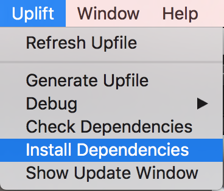

The dependencies will be installed under Assets, in a repository whose path you can configure in your `Upfile.xml` file

## Scenario: migrating to uplift

Given a project containing an existing skeleton. What you wish is to create reusable modules most probably maintained outside of your project so that you can reuse them in other projects.

Here's a set of steps towards that:

1. identify your reusable modules

2. identifiy the dependencies between those modules

    * If necessary break them, using techniques such as dependency injection, proper namespacing, etc

3. prepare for Uplift project layout

    Create the project structure that your project will have. Move modules into this structure.

4. move modules out of your project one by one

    * optionally move them to own version control

    * use uplift to package them with their own version numbers

    * release them into a shared repository

    * reference them in your project using uplift and reimport them as suited

5. consider making a skeleton module that depends on your basic modules

    this to ease quick starting a new project
  